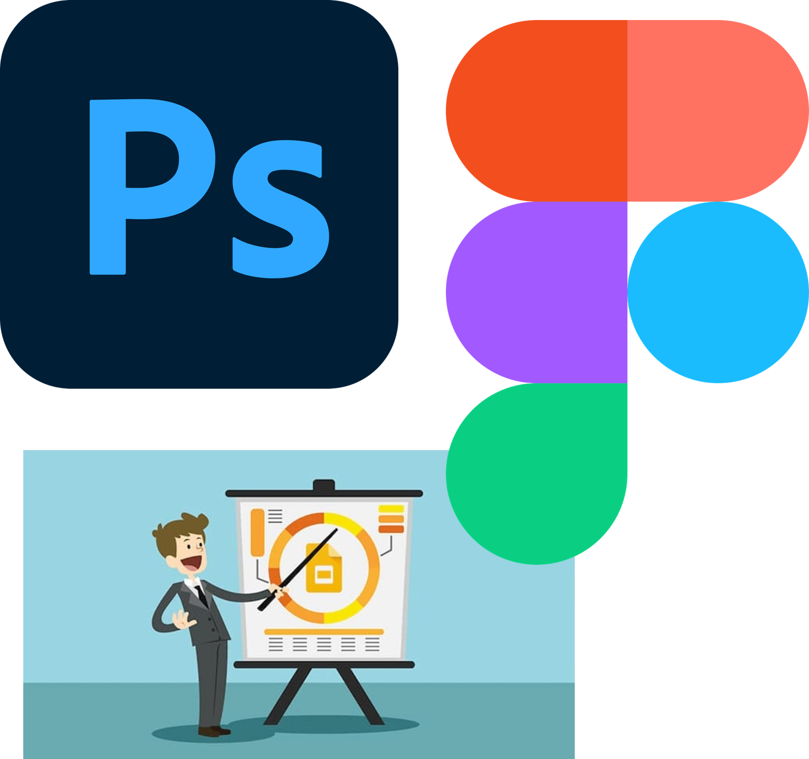

# Deli Caffe

## Descripción
Este proyecto consiste en el diseño de experiencia y visualización de interfaces de usuario para una cafetería ficticia en Estados Unidos cuyo valor agregado es el de ofrecer ambientes relajantes y atención y delivery cómodo.

## Objetivos
#### General
El objetivo general de este proyecto ha sido aplicar los conocimientos aprendidos en la especialización de UX/UI Design Specialization de California Institute of Arts proveído mediante Coursera con la identificación y análisis del público objetivo, creación de experiencia de usuario y elaboración de prototipos de bajo y alto nivel para una aplicación de delivery requerida por el negocio.

#### Específicos
- Describir el concepto del negocio con detalles sobre su menu, ubicación y elevator pitch.
- Identificar, analizar y describir el público objetivo.
- Identificar y registrar las necesidades del público objetivo.
- Definir requerimientos en base a las necesidades del público objetivo.
- Crear un sitemap que muestre la estructura de la aplicación en el que se reflejen los requerimientos funcionales del proyecto.
- Crear wireframes en base a la estructura definida en el sitemap.
- Crear una moodboard que  el estilo que se va a utilizar en la aplicación.
- Crear mockups donde se evidencie la estructura de los wireframes y el concepto de diseño del moodboard.
- En base a los mockups creados y al sitemap elaborar un prototipo en Figma.

## Herramientas Utilizadas
- Microsoft Word
- Adobe Photoshop
- Figma

## Resultados
La documentación completa del proyecto se encuentra en formato pdf y docx en el presente repositorio en donde se incluyen la definición del negocio, público objetivo, requerimientos, sitemap, wireframes, moodboard y mockups.

El prototipo de Figma se encuentra en el siguiente link indicado siguiendo los pasos a continuación: 
 
- Ingreso al link: https://www.figma.com/design/wM93gMzA4WvSSYigK0eHfm/DeliCaffe?node-id=0-1&t=oLusjuBQfddAdH2M-1
 
- Una vez en el sitio principal haga click en el ícono de presentación.

 
- En caso de requerir visualizar las opciones disponibles haga un click en el espacio fuera del prototipo y las opciones aparecerán en forma de cuadros azules.

## Aprendizaje
Mediante este proyecto he aprendido más sobre el proceso de creación de experiencia de usuario y diseño de interfaces. De igual forma he logrado profundizar en los conceptos de user persona, sitemap y moodboard. Además, este proyecto me ha permitido aprovechar y mejorar mis habilidades técnicas en photoshop y figma y en mis habilidades de comunicación escrita en inglés y elaboración de presentaciones.

